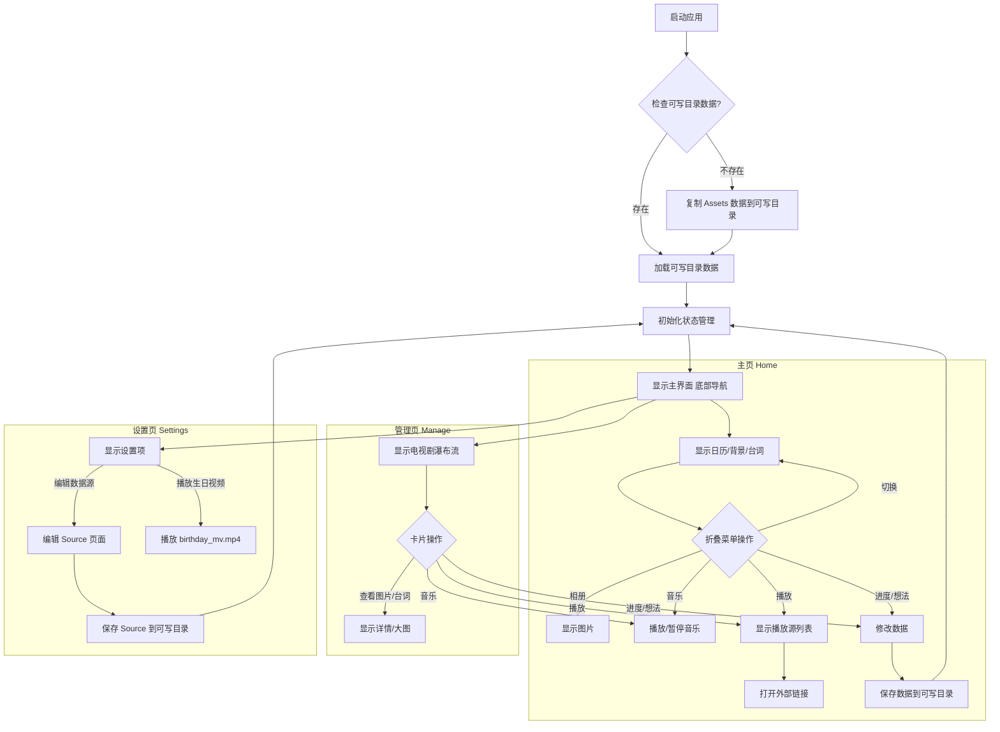

# ShuangJu - Enjoy TV Dramas 🎬

[English] [[简体中文](https://github.com/pu-007/ShuangJu/blob/main/README.zh.md)]

A personalized management app designed for TV drama enthusiasts. Easily collect your favorite TV drama stills, classic lines, track viewing progress, and record your unique thoughts.

## 📸 **Screenshots**

<table style="margin: 0 auto;">
  <tr>
    <td style="text-align: center;">
      
      
Home

    </td>
    <td style="text-align: center;">
      
      
Management

    </td>
    <td style="text-align: center;">
      
      
Details

    </td>
  </tr>
</table>

## ✨ **Key Features**

- **Series Management:** Centrally manage your TV drama collection.
- **Stills and Lines:** Save and browse beautiful stills and touching lines.
- **Drama Calendar:** Intuitively display drama viewing plans and progress.
- **Online Playback:** Quickly jump to configured online playback sources.
- **Lines Album:** Review classic lines and related stills in card or album form.
- **Progress Tracking:** Record viewing progress for each drama.
- **Personal Thoughts:** Record your thoughts and reflections on the drama at any time.
- **TMDB Integration:** Automatically retrieve information from The Movie Database (TMDB) when adding new dramas.
- **Data Management:** Conveniently add, edit, and manage TV drama data.
- **Birthday Surprise:** Built-in special birthday greeting video playback feature.

## 👨‍💻 **Tech Stack**

- **Framework:** Flutter
- **Language:** Dart

## 📋 **Graph**

