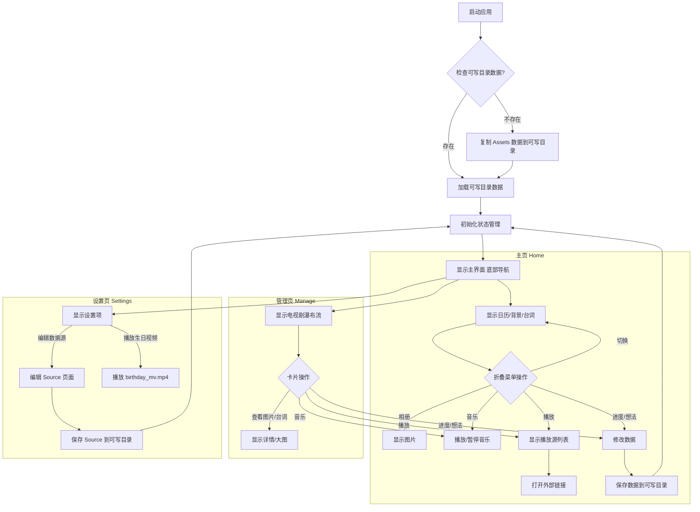

# ShuangJu - 爽剧 🎬

[[English](https://github.com/pu-007/ShuangJu/blob/main/README.md)] [简体中文]

一款专为电视剧爱好者设计的个性化管理应用，轻松收藏您喜爱的电视剧剧照、经典台词，追踪观看进度，并记录您的独特想法。

## 📸 **截图**

<table style="margin: 0 auto;">
  <tr>
    <td style="text-align: center;">
      
      
主页

    </td>
    <td style="text-align: center;">
      
      
管理

    </td>
    <td style="text-align: center;">
      
      
详情

    </td>
  </tr>
</table>

## ✨ **主要功能**

- **剧集管理:** 集中管理您的电视剧收藏。
- **剧照与台词:** 保存和浏览精美的剧照以及触动人心的台词。
- **追剧日历:** 直观展示追剧计划和进度。
- **在线播放:** 快速跳转到配置好的在线播放源。
- **台词相册:** 以卡片或相册形式回顾经典台词和相关剧照。
- **进度追踪:** 记录每部剧的观看进度。
- **个人想法:** 随时记录您对剧集的感想和思考。
- **TMDB 集成:** 添加新剧集时自动从 The Movie Database (TMDB) 获取信息。
- **数据管理:** 方便地添加、编辑和管理电视剧数据。
- **生日惊喜:** 内置特别的生日祝福视频播放功能。

## 👨‍💻 技术栈

- **框架:** Flutter
- **语言:** Dart

## 📋 **图示**

